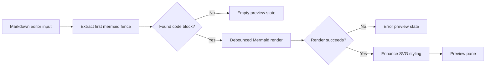

# Mermaid Visualizer Design

Date: 2026-07-01

## Goal

Build a pure frontend single-page web app that turns Markdown Mermaid code blocks into a polished flowchart preview. The competitive focus is visual quality: the output should feel more professional, readable, and product-grade than default Mermaid rendering.

## Scope

The first version supports this workflow:

- The left pane accepts Markdown text.
- The app extracts the first fenced `mermaid` code block.
- The right pane renders the Mermaid diagram as an SVG preview.
- The left and right panes can be resized by dragging the divider.
- The right preview can enter and exit fullscreen.
- All parsing, rendering, styling, and state persistence run in the browser. There is no backend request.

The first version optimizes `flowchart` and `graph` diagrams. Other Mermaid diagram types may render through Mermaid, but they are not guaranteed to receive the same visual polish.

## Visual Direction

The visual baseline is `Product SaaS`: crisp, modern, developer-tool oriented, and readable under repeated use.

The flow line style is `Soft Orthogonal`:

- Rounded orthogonal connectors instead of rough default paths.
- Low-saturation gray-blue strokes.
- Stroke weight around `2.2px`.
- Rounded line caps and joins.
- Refined arrowheads with restrained size and weight.
- Good spacing between nodes and edges so dense diagrams remain scannable.

Node styling:

- White node fill.
- Light gray-blue border.
- Subtle shadow for elevation, not decoration.
- Tight but comfortable padding.
- Border radius no larger than 8px.
- Clear typography with a system sans-serif stack.

Canvas styling:

- Light gray-blue preview background.
- The diagram sits inside an unframed preview surface.
- Avoid decorative gradients, heavy color fills, or presentation effects that reduce readability.

## Recommended Technical Approach

Use Mermaid as the syntax and SVG generation layer, then apply a visual enhancement layer after render.

Reasons:

- Mermaid syntax compatibility is much better than writing a parser from scratch.
- The app remains pure frontend.
- The first version can ship quickly while still improving the rendered appearance.
- CSS and SVG post-processing can normalize the roughest default Mermaid visual details.

Tradeoff:

- Mermaid and its layout engine limit how deeply the app can control edge routing. The first version should improve the default output substantially, but it should not promise a fully custom graph layout engine.

## Architecture

The app has four main units:

1. Markdown extraction

   Input: Markdown string.

   Output: the first Mermaid code block, or an empty result if none exists.

   Behavior:

   - Recognizes fenced blocks with `mermaid` as the language.
   - Trims leading and trailing whitespace inside the block.
   - Keeps parsing deterministic and side-effect free.

2. Mermaid rendering

   Input: Mermaid source string.

   Output: rendered SVG markup or a structured render error.

   Behavior:

   - Initializes Mermaid with a custom theme.
   - Debounces editor changes before rendering.
   - Re-renders when the code block changes.
   - Does not call any backend service.

3. Visual enhancement

   Input: rendered Mermaid SVG.

   Output: styled SVG inside the preview pane.

   Behavior:

   - Applies Product SaaS theme variables.
   - Normalizes node fill, border, shadow, text color, and background.
   - Normalizes edge stroke color, stroke width, line caps, joins, and arrow marker styling.
   - Prefers rounded orthogonal edge presentation where Mermaid output supports it.
   - Keeps labels readable and avoids aggressive animation.

4. Layout shell

   Responsibilities:

   - Two-pane app layout.
   - Drag-resizable divider.
   - Width persistence with `localStorage`.
   - Preview fullscreen toggle.
   - Empty and error states.

## User Interface

The page uses a focused tool layout, not a marketing landing page.

Left pane:

- Header: `Markdown Input`.
- Text editor area with a default example.
- Uses a monospace font.
- Supports normal paste and typing.

Divider:

- Thin draggable vertical handle.
- Uses `col-resize` cursor.
- Enforces minimum widths for both panes.

Right pane:

- Header: `Visual Preview`.
- Fullscreen icon/button.
- Preview canvas below the header.
- Shows the rendered diagram, empty state, or render error.

Fullscreen:

- Uses the browser Fullscreen API when available.
- Falls back to an expanded fixed-position overlay if Fullscreen API fails.
- Exiting fullscreen returns to the previous split layout.

## States

Default:

- The app loads with a sample Markdown document containing a Mermaid flowchart.
- The preview renders immediately.

No Mermaid block:

- The preview shows a concise empty state explaining that a fenced Mermaid block is required.

Render error:

- The preview shows a readable error panel with Mermaid's error message.
- The editor remains usable.
- The last successful render may be retained only if it does not make the error state ambiguous. The preferred first version behavior is to show the error state clearly.

Resizing:

- Dragging updates the split in real time.
- The app clamps pane widths to prevent unusable layouts.
- The final width is saved to `localStorage`.

## Data Flow

## Testing Plan

Focused tests should cover:

- Extracting a Mermaid block from Markdown.
- Returning empty state when no Mermaid block exists.
- Rendering the default sample.
- Showing an error state for invalid Mermaid syntax.
- Dragging the divider and clamping widths.
- Persisting and restoring split width.
- Entering and exiting fullscreen.
- Visual smoke test that confirms the right pane renders a non-empty SVG.

## Out Of Scope

- Backend rendering or storage.
- Collaborative editing.
- Multiple Mermaid block tabs.
- Export to PNG/SVG/PDF.
- Full custom graph layout engine.
- Guaranteed visual enhancement for every Mermaid diagram type.

## Implementation Notes

Start with a Vite-based frontend app unless the implementation environment reveals a stronger existing convention. Use Mermaid as a dependency. Prefer simple, local modules over a large state management framework.

The visual layer should be implemented as a combination of Mermaid theme configuration and scoped CSS/SVG post-processing. Keep the enhancement layer isolated so future versions can replace Mermaid's rendered paths with a custom renderer if deeper routing control becomes necessary.
